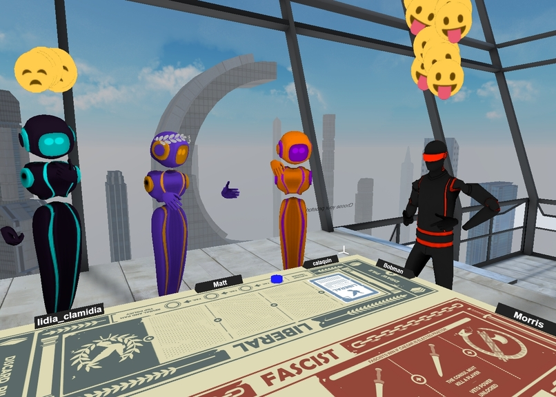

# secret-caesar

A social deduction board game, adapted for AltspaceVR.

## What is Secret Caesar?

Secret Caesar is a social deduction game for 5–10 people about finding and stopping the rise of a dictator.

The majority of players are liberals. If they can learn to trust each other, they have enough votes to control the table and win the game. But some players are fascists. They will say whatever it takes to get elected, enact their agenda, and blame others for the fallout. The liberals must work together to discover the truth before the fascists install their cold-blooded leader and win the game.

## Options

* `userWhitelist=<id1>,<id2>,...` - Only allow users with these IDs to play the game

## Progress

- [x] Setup
	- [x] Player join
	- [x] Player leave
	- [x] Player kick
	- [x] Start game
- [x] Night phase
	- [x] Assign roles
	- [x] Player roles revealed (discreetly)
- [x] Election
	- [x] Presidential candidate chosen
	- [x] Nominate chancellor candidate
	- [x] Enforce term limits
	- [x] Vote
	- [x] Display vote results
	- [x] Special election
	- [x] Failed vote counter
	- [x] Check for election victory
- [x] Pass policy
	- [x] Deck cycling
	- [x] President chooses from three top cards
	- [x] Chancellor chooses from remaining two
	- [x] Display chosen policy
	- [x] Check for policy victory
	- [x] Veto
- [x] Presidental powers
	- [x] Investigate player
	- [x] Peek at policy deck
	- [x] Choose successor
	- [x] Assassinate
	- [x] Check for assassination victory
- [ ] Polish
	- [x] Instructions
	- [x] Animations/transitions
	- [ ] Action sound effects
	- [x] Consequence sound effects
	- [x] Music?

## Credits and License

&copy; 2017 Microsoft

The original game [Secret Hitler](http://secrethitler.com/), &copy; Goat, Wolf, & Cabbage, was created by Mike Boxleiter, Tommy Maranges, Max Temkin, and Mac Schubert. Mackenzie Schubert did the illustrations. It was adapted for VR by Steven Vergenz, with new illustrations by Evan Sforza. The original board game and this derivative work are licensed under a [Creative Commons BY-NC-SA 4.0](https://creativecommons.org/licenses/by-nc-sa/4.0/) license.

The recording of Wagner's *Die Walküre - Ride of the Valkyries* used in this game was recorded by the University of Chicago Orchestra, and is under a [Creative Commons BY-NC-ND 3.0](https://creativecommons.org/licenses/by-nc-nd/3.0/) license.

The recording of Beethoven's *Symphony No. 5 in Cm - Andante con moto* used in this game was recorded by the Fulda Symphonic Orchestra, and is under a [Creative Commons BY-SA 3.0](https://creativecommons.org/licenses/by-sa/3.0/) license.